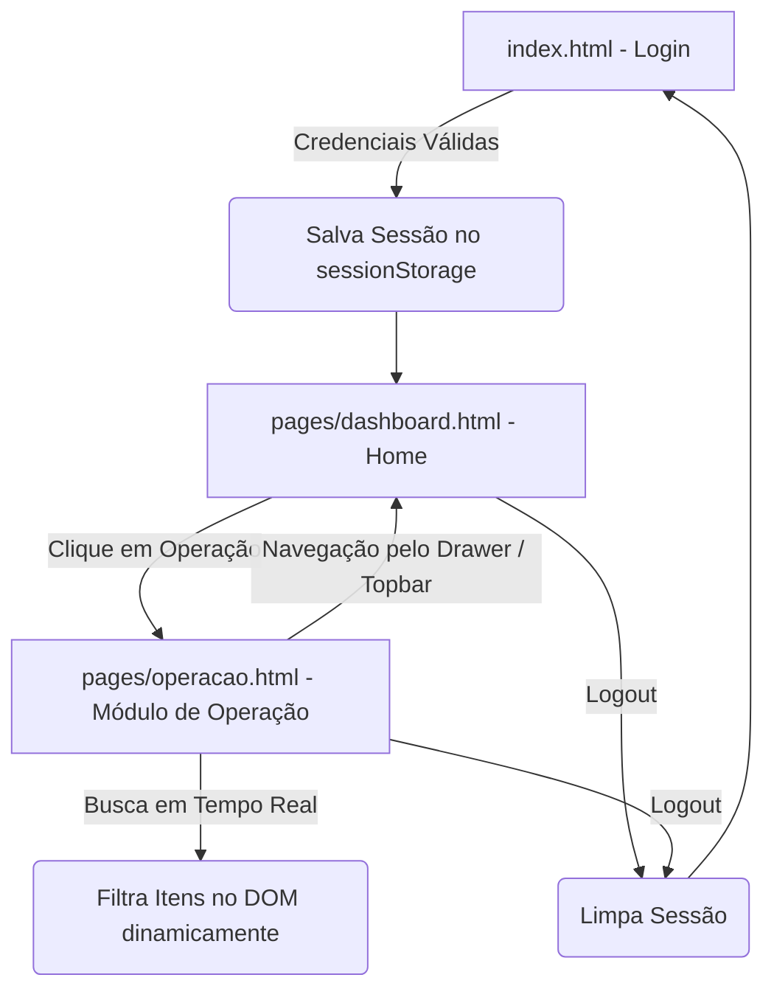

# Arquitetura Técnica - Goflash CORE (Protótipo Navegável)

Este documento descreve detalhadamente a arquitetura técnica do protótipo navegável do ERP **Goflash CORE / GoMarket**, identificando os módulos existentes, fluxo de dados, padrões de componentes, decisões arquiteturais e pontos de atenção para futuras expansões.

---

## 1. Visão Geral da Arquitetura

O projeto é estruturado como uma **aplicação estática multi-page (MPA)** baseada em padrões web modernos e nativos (HTML5, CSS3 puro e JavaScript ES6+ Vanilla).

A arquitetura foi projetada para:
1. **Execução Instantânea**: Não necessita de processo de build, transpilação ou servidores de aplicação complexos. Pode ser executada diretamente via protocolo `file://` ou por qualquer servidor HTTP estático (Nginx, Live Server, GitHub Pages).
2. **Alta Fidelidade Visual**: Réplica pixel-perfect do ERP GoMarket/Goflash CORE com Design Tokens bem definidos.
3. **Escalabilidade Modular**: Estrutura de classes e scripts padronizados (`module-view.css`, `module-search.js`) que permitem adicionar novos módulos em minutos.

---

## 2. Estrutura de Diretórios e Responsabilidades

```
Protótipo Navegavel Core/
├── assets/
│   ├── css/
│   │   ├── global.css        # Variáveis CSS (Tokens), resets, tipografia e Material Icons
│   │   ├── components.css    # Componentes reutilizáveis (inputs, botões, checkbox, toast)
│   │   ├── login.css         # Estilização e layout da tela de login
│   │   ├── dashboard.css     # Estilos da Home (Hero, Topbar dinâmico, Cards e Drawer)
│   │   ├── module-view.css   # Template CSS unificado para todas as páginas de módulos
│   │   ├── abastecimento.css # Estilos de planos e pedidos de abastecimento
│   │   ├── consulta-abastecimento.css # Layout da tela de consulta, steppers táteis e sticky footer
│   │   └── ai-chat.css       # Design System do Chat com IA (GoFlash AI) e FAB
│   ├── js/
│   │   ├── auth.js           # Gerenciador de autenticação, sessão e navegação protegida
│   │   ├── toast.js          # Sistema leve de notificações com auto-dismiss
│   │   ├── dashboard.js      # Gerenciador de eventos do dashboard, drawer, scroll e popovers
│   │   ├── navigation.js     # Motor declarativo de navegação contextual e histórico
│   │   ├── module-search.js  # Motor de busca dinâmica com filtragem instantânea no DOM
│   │   ├── abastecimento-controller.js # Controlador de planos de abastecimento
│   │   ├── pedidos-abastecimento-controller.js # Controlador da listagem de pedidos
│   │   ├── consulta-abastecimento-controller.js # Controlador da tela avançada de consulta
│   │   ├── ai-chat-knowledge.js # Base de conhecimento e respostas simuladas da IA
│   │   ├── ai-chat-controller.js # Controlador do widget flutuante de IA
│   │   ├── ai-chat-fullscreen-controller.js # Controlador da página exclusiva de Chat IA
│   │   ├── version.js        # Script de sincronização dinâmica da versão no DOM
│   │   └── data/
│   │       ├── abastecimento-mock.js # Mock de dados de planos de abastecimento
│   │       └── pedidos-abastecimento-mock.js # Mock de pedidos e catálogo de produtos com fotos
│   └── images/               # Logos oficiais e fotos de produtos em alta definição
├── docs/
│   ├── architecture.md       # Este documento de arquitetura técnica
│   └── design-system.md      # Especificação viva do Design System
├── pages/
│   ├── dashboard.html        # Página principal (Home Page)
│   ├── chat-ia.html          # Página Exclusiva do Assistente GoFlash IA (Full-Screen)
│   ├── operacao.html         # Página do Módulo de Operação
│   ├── planos-abastecimento.html # Tela de Planos de Abastecimento
│   ├── pedidos-abastecimento.html # Tela Oficial de Pedidos de Abastecimento
│   └── consulta-abastecimento.html # Tela Avançada de Consulta para Abastecimento
├── index.html                # Ponto de entrada (Tela de Login)
├── version.json              # Fonte de verdade de versão e status dos módulos
├── CHANGELOG.md              # Registro histórico de alterações (SemVer)
├── README.md                 # Instruções de execução e credenciais simuladas
└── AGENTS.md                 # Manual de diretrizes para IAs
```

---

## 3. Principais Módulos do Sistema

### 3.1 Módulo de Autenticação (`index.html`, `auth.js`, `login.css`)
- **Responsabilidade**: Ponto de entrada do sistema. Realiza a validação das credenciais simuladas, gerencia o estado da sessão em `sessionStorage`/`localStorage`, animações de carregamento (loading spinner e ripple effect) e tratamento de erros com animação de tremor (*shake*) e notificações Toast.

### 3.2 Painel Principal / Home (`pages/dashboard.html`, `dashboard.js`, `dashboard.css`)
- **Responsabilidade**: Hub central de navegação do ERP. Contém:
  - **Hero Section**: Marca d'água central (`logo-homepage.png`) com barra inferior roxa (`#6530b5`), logo horizontal e botão flutuante FAB amarelo com rolagem suave.
  - **Topbar Dinâmico**: Transiciona de fundo escuro para roxo sólido ao rolar para a área de módulos.
  - **Atalhos Rápidos (9 pontos - Apps Popover)**: Grade com divisão horizontal contendo atalhos para os módulos do sistema.
  - **Menu de Usuário (User Popover)**: Exibe avatar, nome, cargo, botão de configurações e botão de logout.
  - **Menu Lateral Retrátil (Drawer)**: Gaveta com cabeçalho roxo, logotipo oficial, divisórias e links de módulos.
  - **Grid de Módulos ERP**: Cards dos módulos (*Gerencial*, *Operação*, *Financeiro*) com animação suave de deslizamento no hover.

### 3.3 Módulo de Operação (`pages/operacao.html`, `module-view.css`, `module-search.js`)
- **Responsabilidade**: Painel operacional do varejo e franquias. Contém:
  - **Barra de Pesquisa Dinâmica no Topbar**: Busca instantânea por termo ou categoria com destaque visual (`<mark>`).
  - **Layout Escalonado Assimétrico**: Card principal da esquerda sobrepondo o banner superior roxo e cards laterais da direita (*Relatórios*, *Integrações*, *Configurações*) iniciando com recuo vertical.
  - **Marcação Visual**: Barrinha roxa (`border-top: 4px solid #6530b5`) em todos os cards.

---

## 4. Principais Componentes de Interface

| Componente | Arquivo de Origem | Comportamento |
|---|---|---|
| **Input com Linha Inferior** | `components.css` | Campo de entrada estilo Material Design com linha inferior animada e ícone de prefixo |
| **Botão Primário / Ripple** | `components.css` | Botão roxo `#6530b5` com efeito de onda ao clicar e suporte a estado de loading |
| **Sistema de Toast** | `toast.js` / `components.css` | Container flutuante no canto superior direito para mensagens `success`, `error`, `warning` e `info` |
| **Drawer / Gaveta Lateral** | `dashboard.css` | Menu retrátil à esquerda com backdrop escuro e animação `translateX` |
| **Popovers Flutuantes** | `dashboard.css` | Menus com seta direcional que fecham automaticamente ao clicar fora (`click outside`) |
| **Cards de Módulos com Hover** | `dashboard.css` | Cards com banner colorido cujo ícone desliza suavemente para o centro no hover |
| **Motor de Busca de Módulo** | `module-search.js` | Normaliza strings (remove acentos), filtra nós do DOM e exibe fallback para "Nenhum resultado" |

---

## 5. Fluxo da Aplicação e Ciclo de Dados



1. O usuário acessa [`index.html`](file:///c:/Users/Aldo%20Farias/Documents/Projetos%20DEV/B2U/Prot%C3%B3tipo%20Navegavel%20Core/index.html) e insere as credenciais (`B2U` / `b2u@sistemas`).
2. O módulo [`assets/js/auth.js`](file:///c:/Users/Aldo%20Farias/Documents/Projetos%20DEV/B2U/Prot%C3%B3tipo%20Navegavel%20Core/assets/js/auth.js) valida os dados, salva o estado no storage e redireciona para [`pages/dashboard.html`](file:///c:/Users/Aldo%20Farias/Documents/Projetos%20DEV/B2U/Prot%C3%B3tipo%20Navegavel%20Core/pages/dashboard.html).
3. As páginas protegidas invocam `Auth.requireAuth()`. Caso não haja sessão, o redirecionamento para o login é imediato.
4. O usuário navega entre os módulos e o dashboard através de links estáticos e popovers compartilhados.

---

## 6. Subsistema Centralizado de Navegação e Histórico (`NavigationManager`)

Para desacoplar os botões de retorno (Voltar) de rotas fixas e garantir navegação precisa em múltiplos níveis, o módulo [`assets/js/navigation.js`](file:///c:/Users/Aldo%20Farias/Documents/Projetos%20DEV/B2U/Prot%C3%B3tipo%20Navegavel%20Core/assets/js/navigation.js) gerencia a pilha de rotas e sub-visões:

- **Pilha em `sessionStorage` (`goflash_nav_history_stack`)**: Registra a ordem real percorrida pelo usuário (`Home → Operação → Planos (Lista) → Detalhes`).
- **HTML5 History API (`pushState` e `popstate`)**: Permite transicionar entre sub-visões internas sem recarregar a página e sincroniza com o botão Voltar físico/nativo do navegador e gestos mobile.
- **Contrato Declarativo Universal**: Qualquer elemento com `data-nav="back"` e `data-fallback-url="..."` é automaticamente interceptado pelo `NavigationManager`, executando o retorno para a tela/sub-visão anterior sem necessidade de código acoplado na página.

---

## 7. Mocks e Dados Simulados

- **Usuário Simulado**:
  - `username`: `"B2U"` / `"b2u"`
  - `password`: `"b2u@sistemas"`
  - `name`: `"B2U"`
  - `role`: `"Administradores do Sistema"`
- **Versão do Sistema**: `"1.9.4.0"` (definida em [`version.json`](file:///c:/Users/Aldo%20Farias/Documents/Projetos%20DEV/B2U/Prot%C3%B3tipo%20Navegavel%20Core/version.json) e [`assets/js/version.js`](file:///c:/Users/Aldo%20Farias/Documents/Projetos%20DEV/B2U/Prot%C3%B3tipo%20Navegavel%20Core/assets/js/version.js)).
- **Ações de Telas e Relatórios**: Cliques em itens em desenvolvimento acionam notificações informativas via `Toast.info()`.

---

## 7. Decisões Arquiteturais Identificadas

1. **Zero Dependências Externas em Tempo de Execução**:
   - Elimina problemas de compatibilidade, build breaks e necessidade de ferramentas como Node.js ou npm para visualização do protótipo.
2. **CSS Modular por Domínio**:
   - Separação clara entre estilos base (`global.css`), componentes atômicos (`components.css`), dashboards (`dashboard.css`) e telas de módulos (`module-view.css`).
3. **Escopo Global Controlado via Namespaces**:
   - `window.Auth`, `window.Toast` e `window.AppVersion` evitam poluição descontrolada do escopo global e facilitam o consumo em qualquer página.
4. **Resiliência a Fontes e Ícones Offline**:
   - Declaração `@font-face` com fallback em `global.css` e uso de SVGs nativos para elementos de identidade visual garantem renderização fiel mesmo em ambientes com restrição de rede.

---

## 8. Comparativo: Estado Atual vs. Oportunidades Futuras

| Aspecto | O Que Existe Atualmente | O Que Poderia Ser Melhorado Futuramente (Sem ação agora) |
|---|---|---|
| **Roteamento** | Navegação estática multi-page com arquivos HTML independentes | Estrutura de Single Page Application (SPA) ou roteamento por componentes caso o projeto evolua para um framework |
| **Componentes Compartilhados** | Topbar e Drawer replicados no HTML de cada página | Template engine estático ou Web Components nativos (`<custom-element>`) para evitar repetição de HTML |
| **Dados dos Módulos** | Renderizados estaticamente no HTML de cada página de módulo | Catálogo de itens centralizado em JSON consumido via `fetch()` para geração dinâmica de telas |
| **Persistência de Dados** | `sessionStorage` e `localStorage` simples | IndexedDB para mockar operações complexas de CRUD e tabelas de dados |
| **Testes** | Testes manuais visuais e de navegação no navegador | Testes automatizados de interface (ex: Playwright / Cypress) |

---

## 9. Pontos de Atenção para Desenvolvedores e IAs

- **Preservar Padrão de Nomes**: Ao criar novas páginas (ex: `pages/gerencial.html`, `pages/financeiro.html`), reutilize rigorosamente `module-view.css` e `module-search.js`.
- **Manter Links Relativos Corretos**: Atenção aos caminhos de assets em páginas dentro de `pages/` (`../assets/...`) versus a raiz `index.html` (`assets/...`).
- **Não Adicionar Frameworks sem Solicitação**: A ausência de etapas de compilação é intencional e deve ser mantida.
