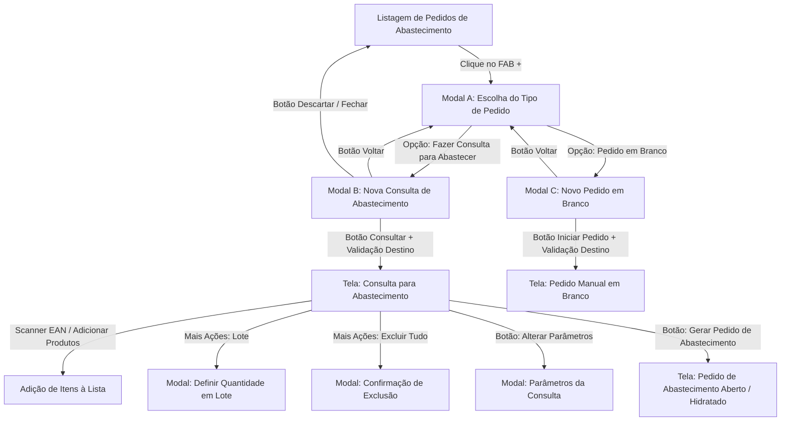

# Especificação Funcional, Requisitos de Desenvolvimento e Critérios de Aceite para QA
## Módulo: Consulta e Abertura de Abastecimento (GoMarket / Goflash CORE)

---

## 1. Visão Geral do Documento

### 1.1 Objetivo
Este documento define formalmente os requisitos funcionais, regras de negócio, especificações de interface (UI/UX), contratos de dados (APIs) e a matriz de testes de qualidade (QA) para o fluxo de **Abertura de Pedidos** e **Consulta Dinâmica para Abastecimento** do ecossistema ERP **Goflash CORE / GoMarket**.

O objetivo deste módulo é permitir que o operador do sistema analise o saldo atual de estoque de uma filial de varejo/loja autônoma, aplique filtros operacionais e planos de abastecimento parametrizados, receba sugestões automatizadas de reposição, efetue ajustes em lote ou individuais e converta os resultados diretamente em um **Pedido de Abastecimento** oficial.

---

### 1.2 Público-Alvo
- **Engenharia de Software (Frontend / Backend / Fullstack)**: Guia completo para implementação de telas, componentes, cálculos e integrações.
- **Engenharia de Qualidade (QA / Testes)**: Base canônica para escrita de planos de teste, automação de testes E2E e validação de critérios de aceite.
- **Product Owners & Gestores de Operação**: Referência de escopo, regras de negócio e ergonomia operacional.

---

### 1.3 Fluxo Geral de Navegação



---

## 2. Atores do Sistema e Permissões

| Papel / Ator | Permissões no Módulo |
|---|---|
| **Operador de Loja / Estoquista** | Abrir consultas, escanear produtos via código de barras, ajustar quantidades sugeridas, adicionar produtos extras e gerar pedidos. |
| **Supervisor de Abastecimento** | Definir parâmetros em lote, alterar planos de abastecimento, filtrar por CD de origem e aprovar pedidos gerados. |
| **Administrador / Suporte** | Acesso total a parametrizações, filiais de origem/destino e regras de ruptura. |

---

## 3. Especificação dos Modais de Abertura

### 3.1 Modal A: Escolha do Tipo de Pedido (`#modalChoicePedido`)

#### 3.1.1 Descrição & Gatilho
- **Gatilho**: Clique no botão flutuante amarelo (`#fabNewPedido`) na tela de listagem de pedidos ([`pages/pedidos-abastecimento.html`](file:///c:/Users/Aldo%20Farias/Documents/Projetos%20DEV/B2U/Prot%C3%B3tipo%20Navegavel%20Core/pages/pedidos-abastecimento.html)).
- **Objetivo**: Apresentar ao operador as duas formas de entrada no fluxo de abastecimento.

#### 3.1.2 Elementos de Interface
1. **Cabeçalho Roxo Oficial** (`#6530b5`): Título `CRIAR PEDIDO DE ABASTECIMENTO` e botão de fechar `&times;`.
2. **Card Opção 1 (Recomendado)**:
   - Ícone: `manage_search` em círculo roxo claro (`#f3ebfc` / `#6530b5`).
   - Título: `Fazer Consulta para Abastecer` (Badge sutil: `Recomendado`).
   - Descrição: *"Sugere automaticamente produtos e quantidades baseado no estoque atual e no plano da loja."*
3. **Card Opção 2**:
   - Ícone: `post_add` em círculo cinza claro (`#f1f3f6` / `#555555`).
   - Título: `Pedido em Branco`.
   - Descrição: *"Inicia um pedido sem itens para você escanear e adicionar produtos manualmente."*
4. **Rodapé**: Botão `CANCELAR` à esquerda.

#### 3.1.3 Regras de Transição
- Ao clicar na **Opção 1**: Fecha Modal A $\rightarrow$ Abre **Modal B** (`#modalNovaConsulta`).
- Ao clicar na **Opção 2**: Fecha Modal A $\rightarrow$ Abre **Modal C** (`#modalNovoPedidoBranco`).
- Ao clicar em **Cancelar**, no `&times;` ou fora do modal (backdrop): Fecha o modal sem ação.

---

### 3.2 Modal B: Nova Consulta de Abastecimento (`#modalNovaConsulta`)

#### 3.2.1 Layout & Elementos de Tela
1. **Cabeçalho**: Título `NOVA CONSULTA DE ABASTECIMENTO`.
2. **Slim Notice Informativo Superior**:
   - Ícone: `manage_search` (`#6530b5`, 19px).
   - Título: `Consulta de Abastecimento` (`#1f2937`, 700).
   - Texto oficial: *"Identifique rapidamente as necessidades de reposição das filiais. Consulte o estoque, aplique os filtros e, ao selecionar um Plano de Abastecimento, receba sugestões de quantidades para abastecer. Em seguida, revise os itens e gere seu Pedido de Abastecimento."*
3. **Campo 1: Selecione a Filial do Estoque Origem (Opcional)**:
   - Select com linha inferior (`.modal-underline-select`) e ícone `warehouse`.
   - Opções: `-- Nenhuma (Sem filial de origem) --` (default) e CDs cadastrados (ex: `CD Principal Zona Sul (000001)`, `Estoque central (000005)`).
   - Badge à direita: `Opcional` ou código da filial.
4. **Campo 2: Selecione a Filial para Repor (Destino - Obrigatório \*)**:
   - Select com linha inferior e ícone `storefront`.
   - Opções: `-- Selecione a filial para repor --` (default) e lojas cadastradas (ex: `Mini Mercado 01`, `Mini Mercado 02 Condomínio Jardins`, `Mini Mercado 03 Simples Nacional`).
   - Badge à direita: exibe código ou `--` se não selecionado.
5. **Campo 3: Plano de Abastecimento (Opcional)**:
   - Select com linha inferior e ícone `description`.
   - Opções: `-- Nenhum plano (Consulta geral / Sem plano) --` (default) e planos da filial.
   - **Helper Text Dinâmico** (`#hintPlanoHelper`):
     - Visível quando *Sem plano*: *"💡 Selecione um plano para receber sugestões automáticas de reposição ou deixe vazio para consulta livre."*
6. **Critérios de Seleção do Plano (Radio Cards - Condicional)**:
   - Fica oculto quando *Sem plano*; é exibido quando um plano for selecionado:
     - `Plano completo`: Exibe todos os produtos pertencentes ao plano selecionado.
     - `Apenas produtos com saldo menor que o estoque ideal`: Filtra apenas itens com necessidade de reposição ($Saldo < Ideal$).
     - `Apenas produtos com saldo menor que o crítico`: Filtra itens com ruptura iminente ($Saldo \le Crítico$).
7. **Rodapé Responsivo de 3 Botões**:
   - Lado Esquerdo: `[ ← VOLTAR ]` (`#btnBackNovaConsulta` - roxo, retorna ao Modal A).
   - Lado Direito: `[ DESCARTAR ]` (`#btnDiscardNovaConsulta` - cinza neutro) e `[ CONSULTAR ]` (`#btnAvancarConsulta` - verde `#4caf50`, 700).

#### 3.2.2 Regras de Validação & Comportamento
- **RN01 (Obrigatoriedade de Filial Destino)**: Se o operador clicar em `CONSULTAR` com a *Filial para Repor* vazia:
  - O campo recebe destaque de erro (`.has-error` com borda vermelha e animação de shake).
  - É disparada uma notificação `Toast.error('Por favor, selecione a filial para repor.')`.
  - A navegação é bloqueada até a seleção de uma filial válida.
- **RN02 (Navegação Bidirecional)**: O botão `VOLTAR` fecha o Modal B e reabre instantaneamente o Modal A, preservando o estado dos campos se o usuário retornar.
- **RN03 (Zero Scroll Mobile/Desktop)**: O modal tem altura total controlada (~420px). No mobile (`max-width: 600px`), os paddings laterais são reduzidos para `0.85rem` e os botões recebem `white-space: nowrap` para evitar cortes ou quebras indesejadas.

---

### 3.3 Modal C: Novo Pedido em Branco (`#modalNovoPedidoBranco`)

#### 3.3.1 Layout & Elementos de Tela
1. **Cabeçalho**: Título `NOVO PEDIDO EM BRANCO`.
2. **Slim Notice Superior**:
   - Ícone: `post_add`.
   - Texto: *"Monte o pedido de reposição adicionando produtos e quantidades manualmente."*
3. **Campo 1: Selecione a Filial para Repor (Destino - Obrigatório \*)**.
4. **Campo 2: Filial do Estoque Origem (Opcional - para Transferências)**.
5. **Rodapé de 3 Botões**: `[ ← VOLTAR ]`, `[ DESCARTAR ]` e `[ INICIAR PEDIDO ]` (`#6530b5`).

#### 3.3.2 Regras de Navegação
- Ao avançar com destino válido: Redireciona para `pedido-manual.html?origem=...&destino=...` com lista de itens vazia pronta para bipagem/inclusão manual.

---

## 4. Especificação da Tela de Consulta para Abastecimento (`consulta-abastecimento.html`)

### 4.1 Cabeçalho Superior (Topbar Primário Roxo)
- **Botão Voltar** (`#topbarBackBtn`): Retorna para a tela de listagem de pedidos (`pedidos-abastecimento.html`).
- **Título**: `Consulta para Abastecimento`.
- **Barra de Pesquisa Global de Produtos** (`#productSearchInput`):
  - Pesquisa em tempo real com debounce (150ms) por Código EAN, Descrição do Produto ou Categoria.
  - Highlight visual dos termos correspondentes com `<mark class="search-highlight">`.
  - Atalho de teclado rápido: `Ctrl + K` foca o campo de busca.
- **Atalhos do Topo Direito**: Popover de 9 pontos (módulos ERP) e perfil do usuário logado.

---

### 4.2 Hero Card de Parâmetros da Consulta
Exibe o resumo das parametrizações ativas e permite reconfiguração:
- **Origem (CD)**: Nome e código do CD (ou *Nenhum*).
- **Destino (Loja)**: Nome e código da filial destino.
- **Plano**: Nome do plano ativo (ou *Sem plano*).
- **Critério**: Critério de filtro ativo (*Completo*, *Saldo < Ideal*, *Saldo <= Crítico*).
- **Botão `ALTERAR PARÂMETROS`** (`#btnEditParams`): Abre o modal `#modalParamsConsulta` para recalcular a consulta sem sair da tela.

---

### 4.3 Toolbar Operacional Otimizada & Focada

```
┌────────────────────────────────────────────────────────────┬────────────────────────┬──────────────┬─────────┐
│ 📷 Escanear código EAN ou digitar (Enter)...              │ + ADICIONAR PRODUTOS   │ ⋮ Mais Ações │  ☰ | ☷  │
└────────────────────────────────────────────────────────────┴────────────────────────┴──────────────┴─────────┘
```

#### 4.3.1 Scanner EAN Inteligente (`#eanScanInput`)
- **Lado Esquerdo**: Campo amplo com ícone `qr_code_scanner` e placeholder dinâmico.
- **Comportamento Operacional**:
  - Aceita leitura direta via leitor de código de barras físico (leitura óptica) ou digitação manual seguida de tecla `[ Enter ]`.
  - Se o produto já estiver na lista: Faz scroll suave até a linha, adiciona **+1 unidade** na coluna *A Repor* e exibe toast de confirmação.
  - Se o produto for do catálogo mas não estiver na lista: Adiciona o item à lista com *Sugestão 0* e *A Repor = 1*.
  - Se o EAN não for encontrado: Exibe `Toast.warning('Produto com código EAN [X] não localizado no catálogo.')`.
  - Após cada bipagem, o input limpa o texto e mantém o foco para bipagens consecutivas.

#### 4.3.2 Botão Primário `+ ADICIONAR PRODUTOS` (`#btnAddExtraProducts`)
- **Visual**: Botão sólido roxo `#6530b5` com ícone `add_circle`.
- **Ação**: Abre o **Modal de Inclusão de Produtos Extras** (`#modalAddExtraProducts`):
  - Combobox de Marcas e Fornecedores com busca e multisseleção.
  - Campo de busca textual rápida por nome, marca ou EAN.
  - Checkbox de condição: *"Apenas produtos com saldo disponível no Estoque de Origem (CD)"*.
  - Tabela/grid de seleção com contagem dinâmica no rodapé (`X produto(s) correspondente(s)`).
  - Botão `INCLUIR PRODUTOS`: Adiciona os itens marcados na consulta atual.

#### 4.3.3 Menu Dropdown Flutuante `[ ⋮ Mais Ações ]` (`#moreActionsDropdown`)
Agrupa as ações secundárias para manter o cabeçalho limpo:
1. **👁️ Ocultar / Mostrar Desmarcados** (`#btnToggleUnselected`):
   - Alterna a visibilidade dos produtos com checkbox desmarcado.
   - Atualiza o ícone (`visibility_off` $\leftrightarrow$ `visibility`) e o texto.
2. **✏️ Definir Quantidade em Lote** (`#btnBatchEditQty`):
   - Habilitado dinamicamente apenas quando **$\ge 1$ item** estiver marcado na tabela.
   - Exibe badge com o número de itens selecionados (ex: `[ 3 ]`).
   - Abre o modal de edição em lote (`#modalBatchEditQty`).
3. ───────── *(Divisor sutil)*
4. **🗑️ Excluir Todos os Produtos** (`#btnClearAllProducts` - classe `.item-danger` em vermelho suave):
   - Abre o modal de confirmação de segurança (`#modalConfirmClearAll`).

#### 4.3.4 Alternador de Visualização Segmentado (`#viewModeToggle`)
- `[ ☰ Tabela ]`: Modo padrão desktop e telas amplas.
- `[ ☷ Cards ]`: Modo cards ideal para mobile e operação rápida por toque.

---

### 4.4 Chips de Filtro Rápido por Status de Estoque
Barra horizontal de chips com contadores em tempo real:
- **`Todos`** (Cinza/Roxo): Total de produtos da consulta.
- **`Abaixo do Ideal`** (Amarelo): Produtos onde $Mínimo < Saldo < Ideal$.
- **`Nível Crítico`** (Laranja): Produtos onde $0 < Saldo \le Mínimo$.
- **`Estoque Zerado`** (Vermelho): Produtos com $Saldo == 0$.
- **`Com Sugestão`** (Verde): Produtos onde o cálculo resultou em $Sugestão > 0$.

> **Regra de Filtro**: O clique em qualquer chip filtra instantaneamente as linhas da tabela e os cards mobile, recalculando o contador do cabeçalho da tabela.

---

### 4.5 Tabela de Reposição & Layout em "Formato Ficha"

#### 4.5.1 Colunas da Tabela
| Coluna | Largura | Alinhamento | Descrição & Comportamento |
|---|---|---|---|
| **Checkbox Mestre (`#chkSelectAll`)** | 44px | Centro | Marca / desmarca todas as linhas visíveis. |
| **Foto** | 52px | Centro | Thumbnail 40x40px com preview ampliado ao clicar. |
| **Produto / Código EAN** | Flexível | Esquerda | **Formato Ficha**: Nome no topo, EAN sutil em cinza e Tag de Status em alto contraste. |
| **Estoque Ideal** | 105px | Centro | Parâmetro do plano cadastrado para a filial. |
| **Mínimo Crítico** | 105px | Centro | Ponto de ruptura cadastrado no plano. |
| **Estoque Loja (Ordenável)** | 110px | Centro | Saldo atual na loja destino. Ordenação por clique $\uparrow \downarrow \updownarrow$. |
| **Estoque CD (Ordenável)** | 110px | Centro | Saldo disponível no CD de origem (se houver). Ordenação $\uparrow \downarrow \updownarrow$. |
| **Sugestão (Ordenável)** | 105px | Centro | Quantidade sugerida pelo sistema. Ordenação $\uparrow \downarrow \updownarrow$. |
| **A Repor** | 150px | Centro | Stepper interativo `[-]` `[input]` `[+]` para ajuste da quantidade final. |
| **Ação (Lixeira)** | 60px | Centro | Botão individual de exclusão da linha. |

#### 4.5.2 Especificação do "Formato Ficha" do Produto
```html
<div class="product-ficha-container">
  <strong class="product-ficha-name">REFRIGERANTE COCA-COLA LATA 350ML</strong>
  <div class="product-ficha-subrow">
    <span class="product-ficha-ean">EAN: 7894900010015</span>
    <span class="status-tag status-critico">Nível Crítico</span>
  </div>
</div>
```
- **Nome do Produto**: Topo com tipografia dominante (`#1f2937`, peso `700`, `font-size: 0.88rem`).
- **Sub-linha Horizontal Unificada**:
  - `EAN: 7894900010015` em tipografia suave e neutra (`#757575`, `font-size: 0.74rem`).
  - `[ Status Tag ]` em tag compacta e sólida (`font-size: 0.68rem`, peso `600`, sem ícones internos) garantindo alinhamento perfeito sem quebra para 3ª linha.

#### 4.5.3 Ordenação Dinâmica Tri-State nas Colunas Numéricas
As colunas **Estoque Loja**, **Estoque CD** e **Sugestão** possuem ordenação por clique com ciclo de 3 estados:
1. **1º Clique**: Ordem Crescente ($\uparrow$ - menor para o maior).
2. **2º Clique**: Ordem Decrescente ($\downarrow$ - maior para o menor).
3. **3º Clique**: Retorno à Ordem Original ($\updownarrow$).

---

### 4.6 Sticky Footer com Métricas & Geração de Pedido

```
┌──────────────────────────────────────┬────────────────────────────────────────────────────────┐
│ Itens Marcados: 6 item(s)            │ [ Descartar ]  [ Salvar Rascunho ]  [ GERAR PEDIDO ]   │
│ Total a Repor: 26 un                 │                                                        │
└──────────────────────────────────────┴────────────────────────────────────────────────────────┘
```

#### 4.6.1 Métricas em Tempo Real
- **Itens Marcados**: Quantidade de produtos selecionados com checkbox ativo.
- **Total a Repor**: Soma matemática das quantidades da coluna *A Repor* de todos os itens marcados.

#### 4.6.2 Ações do Rodapé
1. **`Descartar`**: Confirma o cancelamento e retorna à listagem de pedidos.
2. **`Salvar Rascunho`**: Grava os dados da consulta em `localStorage` (`goflash_consulta_draft`) e exibe toast.
3. **`GERAR PEDIDO DE ABASTECIMENTO`** (Botão de Destaque Verde `#4caf50` / Roxo `#6530b5`):
   - **RN04 (Validação de Quantidade Mínima)**: Exige que pelo menos **1 produto** esteja marcado e com quantidade **> 0**.
   - **Ação**: Cria o novo pedido com status **`Aberto`**, grava o código sequencial (ex: `000047`), data e filiais, e redireciona para a tela de visualização/edição do pedido gerado ([`pages/pedido-manual.html?id=...&codigo=...`](file:///c:/Users/Aldo%20Farias/Documents/Projetos%20DEV/B2U/Prot%C3%B3tipo%20Navegavel%20Core/pages/pedido-manual.html)).

---

## 5. Regras de Negócio & Fórmulas de Cálculo

### 5.1 RN05: Fórmula da Sugestão de Reposição
Quando a consulta utiliza um Plano de Abastecimento:
$$\text{Sugestão} = \max\Big(0,\; \text{Estoque Ideal} - \text{Estoque Atual Loja}\Big)$$

- Se $\text{Estoque Atual Loja} \ge \text{Estoque Ideal}$, a sugestão calculada é **`0`**.
- O valor inicial do campo *A Repor* é preenchido automaticamente com o valor da *Sugestão*.

---

### 5.2 RN06: Matriz de Classificação de Status de Estoque

| Status | Condição Matemática | Cor do Badge | Ação Recomendada |
|---|---|---|---|
| **`Estoque Zerado`** | $\text{Estoque Loja} == 0$ | Vermelho (`#d32f2f`) | Reposição Imediata (Ruptura instalada) |
| **`Nível Crítico`** | $0 < \text{Estoque Loja} \le \text{Mínimo Crítico}$ | Laranja (`#ed6c02`) | Reposição Urgente (Ruptura iminente) |
| **`Abaixo do Ideal`** | $\text{Mínimo Crítico} < \text{Estoque Loja} < \text{Estoque Ideal}$ | Âmbar / Amarelo (`#f57c00`) | Reposição Padrão |
| **`Estoque OK`** | $\text{Estoque Loja} \ge \text{Estoque Ideal}$ | Verde (`#2e7d32`) | Saldo Adequado (Sem necessidade) |

---

### 5.3 RN07: Regras de Edição em Lote
Ao acionar *Definir Quantidade em Lote*:
1. **Definir Valor Fixo**: Aplica o número digitado no campo *A Repor* de todos os produtos selecionados.
2. **Atalhos Rápidos (+X un)**: Chips de `1 un`, `2 un`, `3 un`, `5 un`, `10 un`, `20 un` preenchem instantaneamente o input.
3. **Restaurar Sugestão do Plano**: Se a consulta possui um plano base, o modal oferece o botão *"Restaurar quantidade sugerida pelo Plano de Abastecimento"*, recalculando o valor exato original para cada linha.

---

### 5.4 RN08: Regras de Estoque no CD de Origem
- Se uma filial de estoque de origem (CD) for informada:
  - A coluna *Estoque CD* exibe o saldo do produto no depósito central.
  - No modal de inclusão de produtos, o filtro *"Apenas produtos com saldo disponível no CD"* oculta itens zerados no depósito.

---

## 6. Contratos de Dados & Estruturas de API (JSON)

### 6.1 `GET /api/abastecimento/filiais`
Retorna a lista de filiais disponíveis para reposição e depósitos de origem.

```json
{
  "success": true,
  "data": {
    "origens": [
      { "id": "000001", "nome": "CD Principal Zona Sul", "tipo": "CD" },
      { "id": "000005", "nome": "Estoque central", "tipo": "CD" }
    ],
    "destinos": [
      { "id": "000001", "nome": "Mini Mercado 01", "tipo": "LOJA" },
      { "id": "000002", "nome": "Mini Mercado 02 Condomínio Jardins", "tipo": "LOJA" },
      { "id": "000003", "nome": "Mini Mercado 03 Simples Nacional", "tipo": "LOJA" },
      { "id": "000004", "nome": "Mini Mercado 04 Empresarial Prime", "tipo": "LOJA" }
    ]
  }
}
```

---

### 6.2 `GET /api/abastecimento/planos?filialId=000003`
Retorna os planos cadastrados para a filial selecionada.

```json
{
  "success": true,
  "data": [
    { "id": "000003", "nome": "Plano MiniMercado 03", "totalItens": 42 },
    { "id": "000005", "nome": "Plano Snacks & Mercearia", "totalItens": 18 }
  ]
}
```

---

### 6.3 `POST /api/abastecimento/consulta/calcular`
Calcula as necessidades de reposição com base nos parâmetros do modal.

**Request Payload**:
```json
{
  "filialOrigemId": "000005",
  "filialDestinoId": "000003",
  "planoId": "000003",
  "criterio": "saldo_ideal"
}
```

**Response Payload**:
```json
{
  "success": true,
  "data": {
    "consultaId": "CONS-20260821-001",
    "totalItens": 6,
    "totalSugerido": 26,
    "produtos": [
      {
        "id": "prod-101",
        "ean": "7894900010015",
        "nome": "REFRIGERANTE COCA-COLA LATA 350ML",
        "foto": "../assets/images/products/coca-cola.png",
        "categoria": "Bebidas",
        "fornecedor": "Coca-Cola FEMSA",
        "estoqueIdeal": 12,
        "minimoCritico": 4,
        "estoqueLoja": 3,
        "estoqueCd": 140,
        "sugestao": 9,
        "aRepor": 9,
        "status": "critico",
        "selecionado": true
      }
    ]
  }
}
```

---

### 6.4 `POST /api/abastecimento/pedidos/gerar`
Gera o pedido oficial a partir dos produtos marcados na consulta.

**Request Payload**:
```json
{
  "filialOrigemId": "000005",
  "filialDestinoId": "000003",
  "planoOrigemId": "000003",
  "itens": [
    { "produtoId": "prod-101", "ean": "7894900010015", "quantidade": 9 }
  ]
}
```

**Response Payload**:
```json
{
  "success": true,
  "data": {
    "pedidoId": "ped-000047",
    "codigo": "000047",
    "status": "Aberto",
    "dataCriacao": "2026-08-21T17:45:00",
    "totalItens": 1,
    "totalUnidades": 9,
    "redirectUrl": "./pedido-manual.html?id=ped-000047&codigo=000047"
  }
}
```

---

## 7. Matriz de Casos de Teste & Critérios de Aceite para QA (BDD / Gherkin)

### 7.1 Cenários de Aceite dos Modais de Abertura

#### CT01: Validação de Filial Destino Obrigatória
```gherkin
Cenário: Tentativa de avançar consulta sem informar a filial destino
  Dado que o usuário está na tela de Pedidos de Abastecimento
  E clica no botão flutuante "+ Novo Pedido"
  E escolhe "Fazer Consulta para Abastecer"
  Quando o modal "NOVA CONSULTA DE ABASTECIMENTO" for exibido
  E o campo "Selecione a Filial para Repor" estiver vazio
  E o usuário clicar no botão "CONSULTAR"
  Então o sistema deve aplicar a classe de erro visual no campo de filial destino
  E exibir mensagem de alerta: "Por favor, selecione a filial para repor."
  E o modal não deve avançar para a tela de consulta.
```

#### CT02: Navegação Bidirecional com o Botão "Voltar"
```gherkin
Cenário: Retorno do modal de parametrização para o modal de escolha inicial
  Dado que o usuário abriu o modal "NOVA CONSULTA DE ABASTECIMENTO"
  Quando o usuário clicar no botão "VOLTAR" no canto inferior esquerdo do modal
  Então o modal de consulta deve fechar
  E o modal de escolha inicial ("CRIAR PEDIDO DE ABASTECIMENTO") deve reabrir imediatamente.
```

#### CT03: Reatividade do Helper Text e Critérios de Plano
```gherkin
Cenário: Alternância dinâmica ao selecionar e desmarcar plano de abastecimento
  Dado que o modal de consulta está aberto com "Nenhum plano"
  Então a dica inline com ícone de lâmpada deve estar visível
  E os radio cards de critérios de filtro devem estar ocultos
  Quando o usuário seleciona um plano cadastrado (ex: "Plano Snacks & Mercearia")
  Então a dica inline deve ser ocultada
  E os 3 radio cards de critérios ("Plano completo", "Saldo < Ideal", "Saldo <= Crítico") devem aparecer.
```

---

### 7.2 Cenários de Aceite da Tela de Consulta

#### CT04: Bipagem de Produto Existente via Scanner EAN
```gherkin
Cenário: Leitura de código EAN de produto já listado na consulta
  Dado que a consulta de abastecimento está carregada com produtos
  Quando o operador bipa ou digita o EAN "7894900010015" e pressiona Enter
  Então o sistema deve localizar a linha do produto Coca-Cola
  E incrementar em +1 unidade o valor do campo "A Repor"
  E atualizar os contadores de "Total a Repor" no rodapé
  E exibir toast de feedback verde: "Coca-Cola: quantidade atualizada para X un."
  E limpar o campo de scanner mantendo o foco ativo.
```

#### CT05: Ordenação Tri-State nas Colunas Numéricas
```gherkin
Cenário: Ordenação dinâmica da coluna "Estoque Loja"
  Dado que a tabela de produtos está visível
  Quando o usuário clica no cabeçalho da coluna "Estoque Loja" pela 1ª vez
  Então a tabela deve ser ordenada em ordem Crescente (menor saldo primeiro)
  E o ícone do cabeçalho deve mudar para seta para cima
  Quando o usuário clica pela 2ª vez
  Então a tabela deve ser ordenada em ordem Decrescente (maior saldo primeiro)
  E o ícone deve mudar para seta para baixo
  Quando o usuário clica pela 3ª vez
  Então a tabela deve retornar à ordem original de carregamento.
```

#### CT06: Ação em Lote de Quantidade
```gherkin
Cenário: Aplicação de quantidade em lote para produtos marcados
  Dado que o operador marcou 3 produtos na tabela
  Quando o operador abre o menu "Mais Ações"
  Então a opção "Definir Qtde em Lote" deve estar habilitada com badge "3"
  Quando o operador clica em "Definir Qtde em Lote"
  E seleciona o chip de atalho "5 un"
  E clica em "APLICAR AOS PRODUTOS"
  Então os 3 produtos marcados devem ter sua quantidade "A Repor" alterada para 5
  E o totalizador do rodapé deve ser recalculado imediatamente.
```

#### CT07: Exclusão Total de Produtos com Confirmação de Segurança
```gherkin
Cenário: Limpeza completa da lista de consulta
  Dado que há produtos na tabela de consulta
  Quando o usuário seleciona "Excluir Todos os Produtos" no menu Mais Ações
  Então um modal de confirmação vermelho com ícone de alerta deve ser exibido
  Quando o usuário confirma a exclusão
  Então todas as linhas da tabela devem ser removidas
  E os contadores do rodapé devem exibir "0 item(s)" e "0 un"
  E o botão "GERAR PEDIDO DE ABASTECIMENTO" deve ficar desabilitado.
```

---

### 7.3 Tabela de Casos de Borda (Edge Cases)

| ID | Cenário de Borda | Comportamento Esperado do Sistema |
|---|---|---|
| **EB01** | Filial destino sem nenhum produto com estoque baixo. | Exibir estado vazio com ilustração amigável: *"Tudo certo! O estoque desta filial está abastecido. Você pode incluir produtos avulsos pelo scanner ou botão + Adicionar Produtos."* |
| **EB02** | Digitação de valores negativos ou letras no stepper. | O sistema sanitiza automaticamente o input, convertendo qualquer entrada inválida para `0`. |
| **EB03** | Tentativa de gerar pedido com todos os checkboxes desmarcados. | O botão *Gerar Pedido* fica desabilitado ou emite alerta: *"Selecione ao menos 1 item para gerar o pedido."* |
| **EB04** | Bipe de código EAN inexistente no catálogo geral. | Exibir toast amarelo de aviso: *"Código EAN não localizado no catálogo de produtos."* |
| **EB05** | Perda de conexão / Recarregamento da página (F5). | Se houver rascunho salvo em `localStorage`, o sistema restaura os itens e quantidades previamente configurados. |

---

### 7.4 Checklist de Validação Responsiva & Cross-Device

- [ ] **Desktop Full HD (1920x1080)**: Grid de 2 colunas equilibrado, tabela espaçosa, sticky footer alinhado.
- [ ] **Notebook HD (1366x768)**: Modal de consulta sem barra de rolagem vertical (~420px), tabela com scroll horizontal suave se necessário.
- [ ] **Tablet (768px - 1024px)**: Alternador de visualização `Tabela / Cards` funcionando perfeitamente; modais centralizados.
- [ ] **Smartphones (360px - 430px)**:
  - [ ] Rodapé do modal de abertura com os 3 botões (`Voltar`, `Descartar`, `Consultar`) 100% visíveis **sem corte lateral no botão Consultar**.
  - [ ] Switch para Cards Mobile ativado com steppers táteis de 44px de altura para fácil toque.
  - [ ] Barra de resumo inferior (Sticky Footer) responsiva sem cobrir conteúdo.
